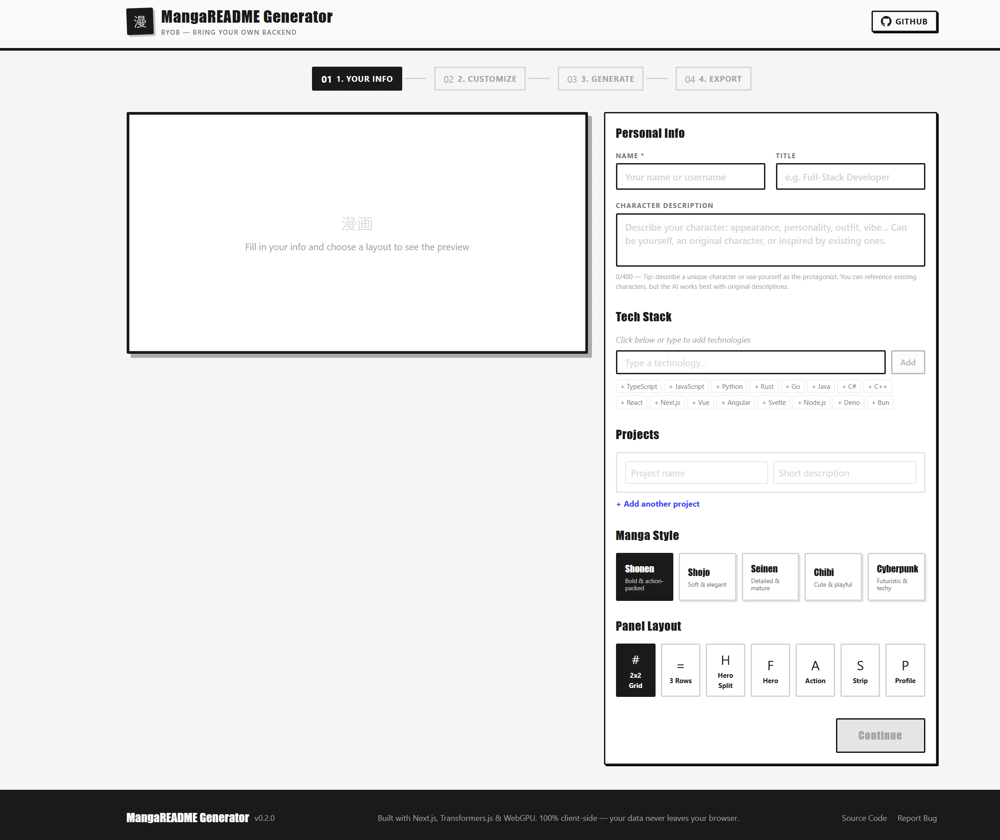
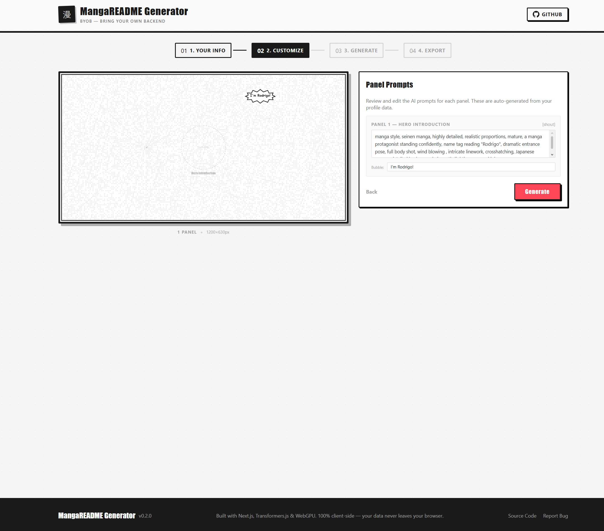
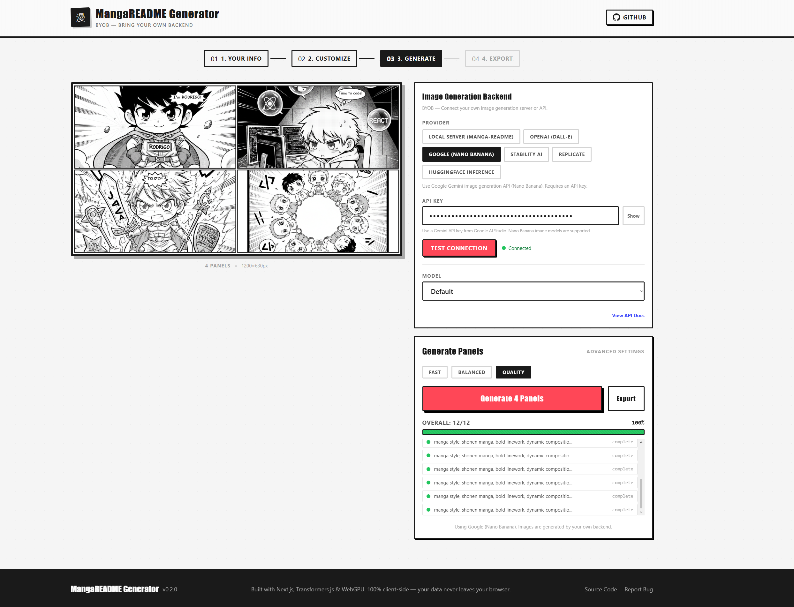
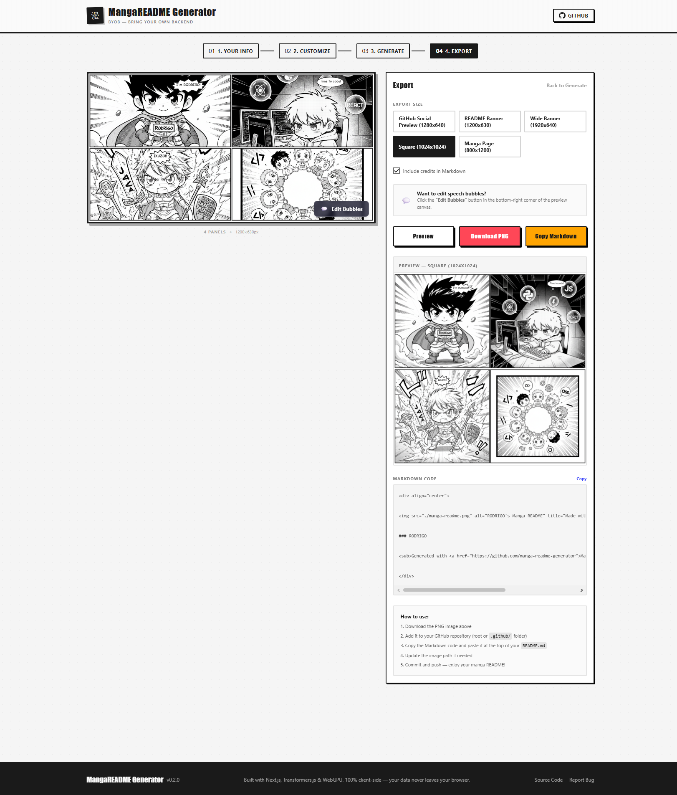

<p align="center">
  
  
  
  
  
</p>

# MangaREADME Generator

> Turn your GitHub profile into a full manga page -- powered by **your own** AI backend.

MangaREADME Generator is an open-source web app that transforms profile data into multi-panel manga pages ready for GitHub READMEs. It follows a **BYOB (Bring Your Own Backend)** architecture: run Stable Diffusion locally via the companion [manga-readme](https://pypi.org/project/manga-readme/) Python package (Diffusers), or plug in an API key for OpenAI, Stability AI, Replicate, or HuggingFace. No vendor lock-in, no data stored server-side.

---

## Table of Contents

- [Overview](#overview)
- [Gallery](#gallery)
- [Features](#features)
- [manga-readme Server (Recommended)](#manga-readme-server-recommended)
- [Supported Providers](#supported-providers)
- [Getting Started](#getting-started)
- [Provider Setup](#provider-setup)
- [Project Structure](#project-structure)
- [Configuration](#configuration)
- [Contributing](#contributing)
- [License](#license)

---

## Overview

```
 INPUT              CUSTOMIZE           GENERATE            EXPORT
 Character          Manga style,        Provider creates    Download PNG,
 description,       layout, prompts,    each panel via      copy Markdown
 tech stack,        speech bubbles      your backend        for GitHub
 projects
```

1. **Input** -- Describe your character, list your tech stack and projects
2. **Customize** -- Choose a manga style and layout; edit prompts and speech bubbles in the Bubble Editor
3. **Generate** -- Connect your provider and generate each panel image
4. **Export** -- Download the final manga page as PNG and copy the Markdown embed snippet

---

## Gallery

<p align="center">
  
</p>

<p align="center">
  
  
  
</p>

<p align="center">
  
  
</p>

---

## Features

| Category | Details |
|----------|---------|
| **BYOB Architecture** | Connect any supported backend -- local server or cloud API |
| **manga-readme PyPI Package** | One-command local AI server powered by Diffusers |
| **5 Manga Styles** | Shonen, Shojo, Seinen, Chibi, Cyberpunk |
| **7 Panel Layouts** | 2x2 grid, 3x1, 1-2-1, hero, action, comic strip, profile |
| **Bubble Editor** | Canva-like editing: move, resize, edit, add/remove bubbles |
| **Speech Bubbles** | Speech, thought, shout, narration, whisper; multiple per panel |
| **Visual Effects** | Speed lines, screentone, halftone, sparkle, impact, radial blur, vignette |
| **LoRA Support** | Load LoRAs with adjustable weights via prompt tags |
| **Model Selection** | DreamShaper 8, SDXL, Animagine XL, Realistic Vision, and more |
| **One-Click Export** | PNG download and ready-to-paste Markdown snippet |

---

## manga-readme Server (Recommended)

The easiest way to generate images locally. Install from PyPI, run one command, and connect the frontend.

### Install

```bash
# For CUDA GPU (recommended) -- install PyTorch first:
pip install torch --index-url https://download.pytorch.org/whl/cu121

# Then install manga-readme:
pip install manga-readme
```

### Run

```bash
manga-readme serve
```

The server starts on `http://127.0.0.1:7860` with **DreamShaper 8** pre-loaded. The model is downloaded automatically on first launch.

### Choose a Model

```bash
manga-readme serve --model sdxl
manga-readme serve --model animagine-xl
manga-readme serve --model realistic-vision
manga-readme list-models
```

### Available Models

| Alias | Architecture | Resolution | Repo |
|-------|-------------|------------|------|
| dreamshaper-8 | SD 1.5 | 512x512 | Lykon/dreamshaper-8 |
| sdxl | SDXL | 1024x1024 | stabilityai/stable-diffusion-xl-base-1.0 |
| sd15 | SD 1.5 | 512x512 | runwayml/stable-diffusion-v1-5 |
| sd21 | SD 2.1 | 768x768 | stabilityai/stable-diffusion-2-1 |
| animagine-xl | SDXL | 1024x1024 | cagliostrolab/animagine-xl-3.1 |
| realistic-vision | SD 1.5 | 512x512 | SG161222/Realistic_Vision_V5.1_noVAE |
| absolute-reality | SD 1.5 | 512x512 | digiplay/AbsoluteReality_v1.8.1 |

You can also pass any HuggingFace repo id: `manga-readme serve --model user/my-model`.

### LoRA Support

Place `.safetensors` or `.pt` LoRA files in a directory and pass it to the server:

```bash
manga-readme serve --lora-dir ./my-loras
```

LoRAs are applied via prompt tags (`<lora:name:0.7>`). The frontend LoRA picker sends these tags automatically. You can also load LoRAs directly from HuggingFace Hub by using the repo id as the LoRA name.

### GPU Requirements

A CUDA GPU with 6 GB+ VRAM is recommended. CPU inference works but is very slow. The server auto-detects CUDA and uses fp16 when available.

---

## Supported Providers

| Provider | Type | Auth | LoRA / Model Select | Notes |
|----------|------|------|---------------------|-------|
| **manga-readme (Diffusers)** | Local server | None | Yes | Recommended -- `pip install manga-readme` |
| **Automatic1111 / Forge / SD.Next** | Local server | None | Yes | Alternative local backend, requires `--api` flag |
| **OpenAI (DALL-E 3)** | Cloud API | API key | No | High quality, fixed sizes (1024x1024, 1792x1024, 1024x1792) |
| **Google (Nano Banana / Gemini)** | Cloud API | API key | No | Gemini image generation via Google API |
| **Stability AI** | Cloud API | API key | No | SD3, SDXL, Ultra via REST API |
| **Replicate** | Cloud API | API key | No | Run open-source models on cloud GPUs |
| **HuggingFace Inference** | Cloud API | Optional token | No | Free tier available, token increases rate limits |

---

## Getting Started

### Prerequisites

| Requirement | Version |
|-------------|---------|
| Node.js | 18+ |
| npm | 9+ |
| Browser | Any modern (Chrome, Edge, Firefox, Safari) |
| Python | 3.10+ (for manga-readme server) |
| Backend | manga-readme server or any supported provider |

### Frontend

```bash
git clone https://github.com/rodrigoguedes09/personal-page.git
cd personal-page
npm install
npm run dev
```

Open [http://localhost:3000](http://localhost:3000) and follow the 4-step wizard.

### Backend (manga-readme)

```bash
pip install manga-readme
manga-readme serve
```

In the frontend, select **Local Server (manga-readme)** and click **Test Connection**.

### Production Build

```bash
npm run build
npm start
```

---

## Provider Setup

### manga-readme (Recommended)

```bash
pip install manga-readme
manga-readme serve --model dreamshaper-8
```

In the app:
1. Select **Local Server (manga-readme)** as the provider
2. Server URL is `http://127.0.0.1:7860` by default
3. Click **Test Connection**
4. Select a model from the dropdown (all registered models appear)
5. Optionally add LoRAs with custom weights (0.0 -- 1.5)

### Automatic1111 / Forge (Alternative)

Start your server with the API enabled and CORS configured:

```bash
./webui.sh --api --cors-allow-origins=http://localhost:3000
```

The same **Local Server** provider in the frontend works with A1111/Forge out of the box.

### OpenAI

1. Get an API key from [platform.openai.com](https://platform.openai.com/)
2. Select **OpenAI (DALL-E)** in the provider panel
3. Paste your API key and test the connection

### Google (Nano Banana / Gemini)

1. Get a Gemini API key from [Google AI Studio](https://aistudio.google.com/app/apikey)
2. Select **Google (Nano Banana)** in the provider panel
3. Paste your API key and test the connection
4. Optionally choose a Gemini model in the model dropdown after connection

### Stability AI

1. Get an API key from [platform.stability.ai](https://platform.stability.ai/)
2. Select **Stability AI** and enter the key

### Replicate

1. Get an API token from [replicate.com](https://replicate.com/)
2. Select **Replicate** and enter the token
3. Default model: `stability-ai/sdxl`

### HuggingFace Inference

1. Optionally get a free token from [huggingface.co/settings/tokens](https://huggingface.co/settings/tokens)
2. Select **HuggingFace Inference**
3. Works without a token (rate-limited); token increases throughput

---

## Project Structure

```
personal-page/
  src/                          -- Next.js frontend
    app/
      layout.tsx                Root layout with metadata and fonts
      page.tsx                  Main 4-step wizard page
      globals.css               Manga-themed Tailwind styles
    components/
      header.tsx                App header with GitHub link
      footer.tsx                App footer
      provider-config.tsx       Provider selection, connection, LoRA/model config
      user-input-form.tsx       Step 1: Character description and profile data
      manga-canvas.tsx          Canvas-based manga page renderer
      generation-view.tsx       Step 3: Generation controls and progress
      export-options.tsx        Step 4: PNG/Markdown export
      progress-bar.tsx          Manga-styled progress indicator
      webgpu-status.tsx         GPU capability badge (informational)
    hooks/
      use-generation.ts         Generation orchestration hook
      use-webgpu.ts             WebGPU detection hook
    lib/
      providers/
        index.ts                Provider factory and metadata registry
        local-sd.ts             Local server API client (manga-readme / A1111)
        openai.ts               OpenAI DALL-E client
        stability.ts            Stability AI client
        replicate.ts            Replicate client with polling
        huggingface.ts          HuggingFace Inference client with retry logic
      constants.ts              Style prompts, generation presets, defaults
      prompt-engine.ts          User data to manga prompt mapper
      manga-layout.ts           7 panel layout algorithms
      canvas-renderer.ts        Canvas drawing with effects and bubbles
      export.ts                 PNG and Markdown export
      utils.ts                  Utility functions
      webgpu.ts                 WebGPU detection and capability check
    store/
      app-store.ts              Zustand global state
    types/
      index.ts                  TypeScript type definitions
  server/                       -- manga-readme Python package (PyPI)
    manga_readme/
      __init__.py               Package version
      __main__.py               python -m manga_readme support
      cli.py                    CLI entry point (serve, list-models)
      server.py                 FastAPI server with A1111-compatible API
      pipeline.py               Diffusers pipeline manager (load, LoRA, txt2img)
      models.py                 Curated model registry
    pyproject.toml              Package metadata and dependencies
    README.md                   PyPI package documentation
    LICENSE                     MIT
  images/                       -- Project screenshots and example exports
```

### Design Decisions

| Decision | Rationale |
|----------|-----------|
| **BYOB Provider System** | No vendor lock-in; users choose their own AI backend |
| **Diffusers-based Server** | Industry-standard library, easy model/LoRA management, pip-installable |
| **A1111-compatible API** | Server speaks the same protocol as A1111 -- frontend works with both |
| **Provider Interface** | All providers implement `ImageProvider` -- uniform API, easy to extend |
| **Zustand** | Lightweight global state over React Context for flat, scalable stores |
| **Canvas 2D** | Direct pixel control for manga effects and efficient PNG export |
| **LoRA Tag Injection** | Standard `<lora:name:weight>` tags parsed and applied by the server |

---

## Configuration

### Manga Styles

| Style | Aesthetic |
|-------|-----------|
| **Shonen** | Bold, high-energy action with dramatic lighting |
| **Shojo** | Soft tones, floral accents, expressive eyes |
| **Seinen** | Detailed, mature, photorealistic manga |
| **Chibi** | Cute, super-deformed characters |
| **Cyberpunk** | Neon-lit, tech-heavy futuristic aesthetic |

### Generation Presets

| Preset | Steps | Resolution | Guidance |
|--------|-------|------------|----------|
| Fast | 15 | 512x512 | 7.0 |
| Balanced | 30 | 512x512 | 7.5 |
| Quality | 40 | 768x768 | 8.0 |

### Server CLI Options

```
manga-readme serve [OPTIONS]

  --host        Bind address      (default: 127.0.0.1)
  --port        Port number       (default: 7860)
  --model       Model alias or HF repo id (default: dreamshaper-8)
  --lora-dir    LoRA directory    (default: ./loras)
  --no-half     Disable fp16      (use on CPU or if NaN outputs)
  --reload      Auto-reload for development
```

---

## Tech Stack

| Component | Technology |
|-----------|-----------|
| Frontend | [Next.js 14](https://nextjs.org/) (App Router) |
| Language (Frontend) | [TypeScript 5](https://www.typescriptlang.org/) |
| Styling | [Tailwind CSS 3.4](https://tailwindcss.com/) |
| State | [Zustand 5](https://zustand-demo.pmnd.rs/) |
| Icons | [Lucide React](https://lucide.dev/) |
| Export | [html-to-image](https://github.com/nicolo-ribaudo/html-to-image) |
| Backend | [FastAPI](https://fastapi.tiangolo.com/) |
| AI Engine | [HuggingFace Diffusers](https://huggingface.co/docs/diffusers) |
| Language (Backend) | Python 3.10+ |

---

## Contributing

1. Fork the repository
2. Create a feature branch (`git checkout -b feature/my-feature`)
3. Commit your changes (`git commit -m 'feat: add my feature'`)
4. Push to the branch (`git push origin feature/my-feature`)
5. Open a Pull Request

### Development Commands

```bash
# Frontend
npm run dev       # Start dev server at http://localhost:3000
npm run build     # Production build
npm run start     # Serve production build
npm run lint      # Run ESLint

# Backend
pip install -e server/          # Install in editable mode
manga-readme serve --reload     # Dev server with auto-reload
manga-readme list-models        # Print model registry
```

### Adding a New Provider

1. Create `src/lib/providers/<name>.ts` implementing the `ImageProvider` interface
2. Add the provider type to `ProviderType` in `src/types/index.ts`
3. Register it in the factory switch in `src/lib/providers/index.ts`
4. Add metadata to `PROVIDER_META` in the same file
5. Add UI for provider-specific settings in `src/components/provider-config.tsx`

### Adding a Model to the Registry

1. Edit `server/manga_readme/models.py`
2. Add a `ModelEntry` with repo_id, alias, label, arch, and default resolution
3. Rebuild and publish: `cd server && python -m build && twine upload dist/*`

---

## License

MIT

---

<p align="center">
  <strong>Built with Next.js, Diffusers, and manga ink</strong>
</p>
